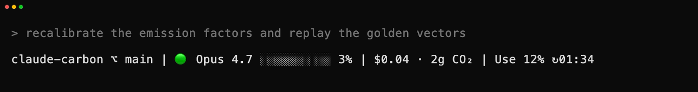
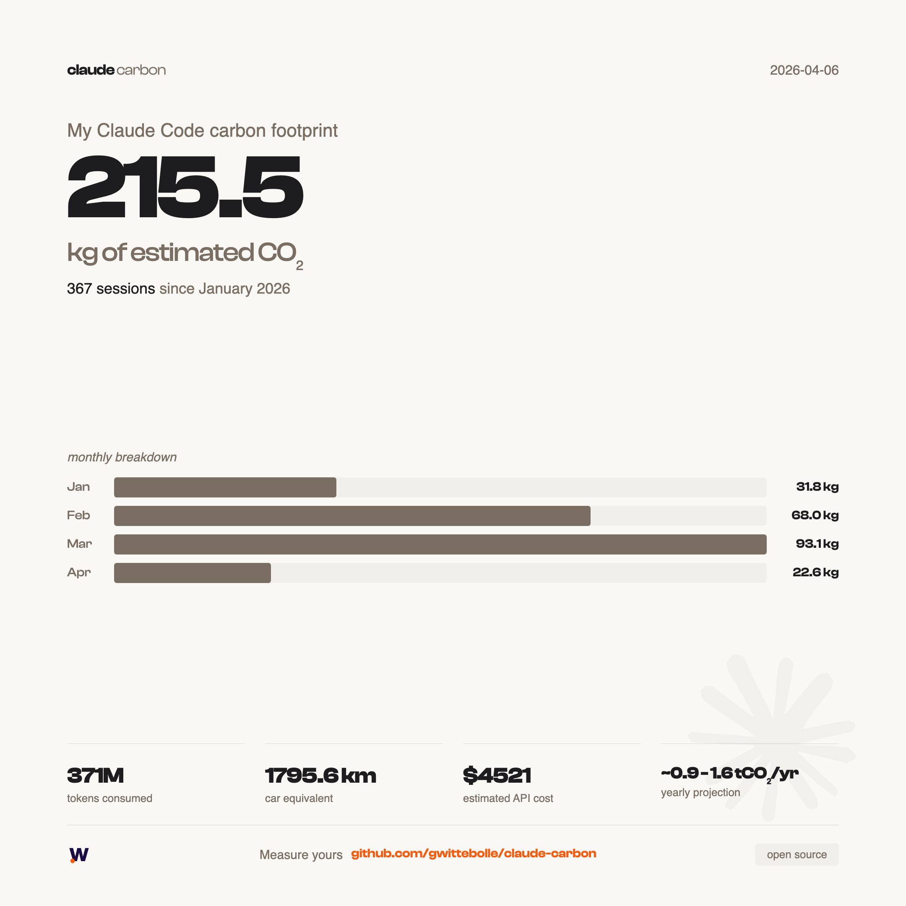
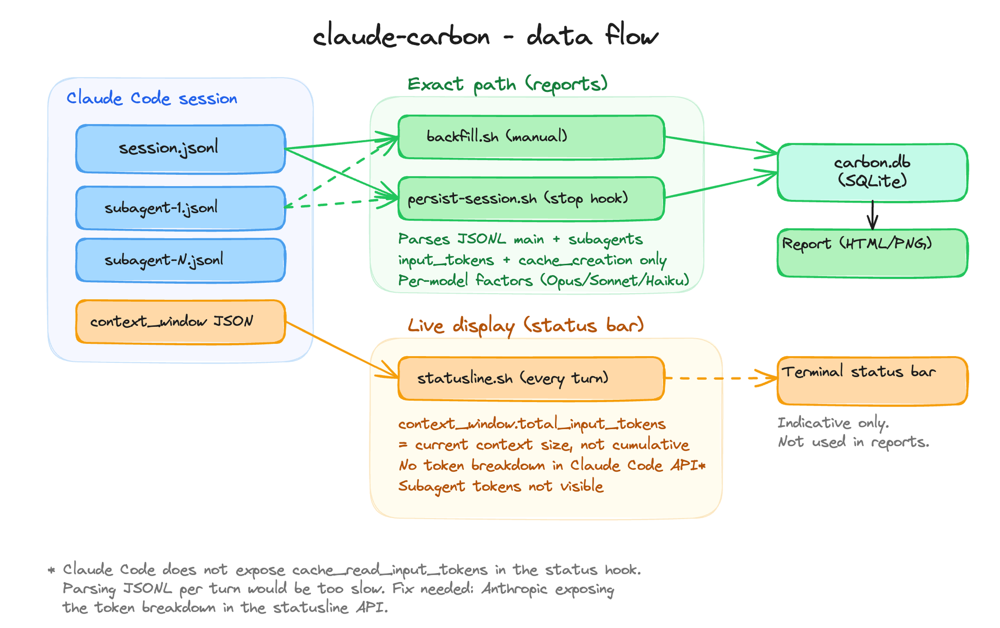

# claude-carbon

[](https://github.com/gwittebolle/claude-carbon/stargazers)
[](LICENSE)
[](https://github.com/gwittebolle/claude-carbon/releases)
[](https://www.npmjs.com/package/claude-carbon)
[](https://github.com/gwittebolle/claude-carbon/actions/workflows/ci.yml)

Track the carbon footprint of your Claude Code sessions.



**1. Install (or update):**

```bash
curl -fsSL https://raw.githubusercontent.com/gwittebolle/claude-carbon/main/install.sh | bash
```

Or, if you have Node.js:

```bash
npx claude-carbon
```

Same command to install and to update to the latest version (both run the same installer).

**2. Restart Claude Code.** Your CO2 appears in the status line:

```
claude-carbon ⌥ main | 🟢 Opus 4.7 ▓▓▓░░░░░░░ 35% | $0.50 · 65g CO₂ | Use 24% ↻13:00
```

Segments, left to right: project + git branch, model + context window %, session cost + CO2, 5h block usage % + reset time. A 🔥 prefix appears when the sustained burn rate would overshoot 100% of the limit by the end of the 5h block (after a 15 min grace window, only once usage reaches 15%).

> **Terminal and IDE only.** claude-carbon runs through the Claude Code status line and shell hooks, which execute in the terminal CLI and IDE extensions. They do not run in the web app (claude.ai/code) or the desktop app, so no CO2 is displayed or recorded there.

**5h quota source.** The percentage comes directly from Anthropic's `/api/oauth/usage` endpoint (the same data Claude Code displays in `/usage`). No heuristic, no token-limit file to seed. Two sources in order:

1. **stdin** (preferred): if Claude Code injects `rate_limits.five_hour.used_percentage` in the statusline JSON, that value is used straight away.
2. **OAuth API fallback**: `GET https://api.anthropic.com/api/oauth/usage` with the bearer token from macOS Keychain, `CLAUDE_CODE_OAUTH_TOKEN`, or `~/.claude/.credentials.json`. Cached 60s in `~/.claude/claude-carbon/oauth-usage.json`.

Accurate on every plan, including Max 20x.

**3. Use the slash commands:**

- `/carbon-report` - text report with totals, equivalences, top sessions
- `/carbon-card` - generate shareable PNG report cards (requires `playwright-core`, see [Dependencies](#dependencies))
- `/carbon-update` - update to the latest version and re-price history (see [Updating](#updating))

## What it does

- Adds a live CO2 estimate to the Claude Code status line, next to the session cost
- Persists each session to a local SQLite database
- Backfills historical data from existing `~/.claude` transcripts
- Two slash commands: `/carbon-report` (text) and `/carbon-card` (PNG)

## Example report

<p align="center">
  
</p>

Generate yours with `/carbon-card` in Claude Code. Exports summary and detailed PNGs to `exports/`.

<details>
<summary>Advanced options (CLI)</summary>

```bash
# Since a specific date
bash ~/code/claude-carbon/scripts/generate-report.sh --since 2026-03-01

# All time
bash ~/code/claude-carbon/scripts/generate-report.sh --all
```

</details>

<details>
<summary>Custom install directory</summary>

```bash
CLAUDE_CARBON_DIR=~/my-path/claude-carbon curl -fsSL https://raw.githubusercontent.com/gwittebolle/claude-carbon/main/install.sh | bash
```

</details>

<details>
<summary>Manual install</summary>

```bash
git clone https://github.com/gwittebolle/claude-carbon.git ~/code/claude-carbon
bash ~/code/claude-carbon/scripts/setup.sh
```

Then add to `~/.claude/settings.json`:

```json
{
  "statusLine": {
    "type": "command",
    "command": "~/code/claude-carbon/scripts/statusline.sh"
  },
  "hooks": {
    "Stop": [
      {
        "matcher": "",
        "hooks": [
          {
            "type": "command",
            "command": "~/code/claude-carbon/scripts/persist-session.sh"
          }
        ]
      }
    ]
  }
}
```

Restart Claude Code.

</details>

## For teams

claude-carbon measures one developer's sessions, locally. If the question comes from your CTO, a client RFP or a CSR committee, the same methodology exists as a hosted layer:

- [Free calculator and per-model factor sheets](https://tokenclimate.com/calculator) - the exact versioned factors of this repo, browsable.
- [Bilan IA](https://tokenclimate.com/bilan) - a self-serve, shareable report of your organisation's real Claude usage (cost, CO2e, water, energy), generated in minutes from an Anthropic admin key. The key is never stored; the methodology annex is citation-ready.
- [TokenClimate](https://tokenclimate.com) - hosted team dashboards. Both sides share this repo's golden vectors, verified weekly in CI.

The only places the OSS points there are a one-line footer in `/carbon-report` and a small credit on the `/carbon-card` PNGs. No status-line promo, no email capture: nothing leaves your machine.

## How it works



**Three data paths, two levels of accuracy:**

| Script               | Trigger                 | Data source           | Subagents    | Cache reads         | Accuracy      |
| -------------------- | ----------------------- | --------------------- | ------------ | ------------------- | ------------- |
| `backfill.sh`        | Manual / setup          | JSONL files           | Included     | Counted (8% energy) | Best estimate |
| `persist-session.sh` | Stop hook (session end) | JSONL files           | Included     | Counted (8% energy) | Best estimate |
| `statusline.sh`      | Every turn (live)       | `context_window` JSON | Not included | Included (approx)   | Approximate   |

**backfill** and **persist-session** parse the raw JSONL transcripts (main session + subagent files), applying per-model emission factors. They deduplicate assistant messages by `(message.id, requestId)`, so resumed and compacted sessions are not double-counted (this matches `ccusage`; without it the token sum inflates roughly 3x). Each session stores its raw token breakdown (input, cache write, cache read, output), which feeds the SQLite database used by reports.

**Cost** is the theoretical API list value (pay-as-you-go), not your subscription price: input, output, cache write (1.25x input), and cache read (0.1x input) at current Anthropic rates, set in `data/prices.json`. On deduplicated data it matches `ccusage`.

**statusline** reads `context_window.total_input_tokens` from Claude Code at each turn. This value represents the current context size (not a cumulative total), includes cache reads, and does not account for subagent tokens. It's an indicative live display, not a data source for reports.

### Surviving the 30-day transcript purge

Claude Code deletes JSONL transcripts after about 30 days, so the SQLite database is the durable record. The `Stop` hook captures each session before its transcript ages out, and a once-a-day background re-scan (`SessionStart` hook, `safety-rescan.sh`) catches any session the `Stop` hook missed while its transcript still exists. Because each row stores raw token counts, `recompute.sh` regenerates cost and CO2 from `data/factors.json` + `data/prices.json` at any time, with no transcript needed. When Anthropic changes a price or a factor is revised, edit the config and run:

```bash
bash scripts/recompute.sh
```

## Commands

| Command          | What it does                                        |
| ---------------- | --------------------------------------------------- |
| `/carbon-report` | Text report with totals, equivalences, top sessions |
| `/carbon-card`   | Generate shareable PNG report cards                 |
| `/carbon-update` | Update to the latest version and re-price history   |

<details>
<summary>Scripts (run automatically, rarely needed manually)</summary>

| Script               | What it does                                                                              |
| -------------------- | ----------------------------------------------------------------------------------------- |
| `setup.sh`           | Init database, backfill historical sessions, show total                                   |
| `statusline.sh`      | Status line script (called automatically by Claude Code)                                  |
| `persist-session.sh` | Stop hook (saves session data on exit)                                                    |
| `safety-rescan.sh`   | SessionStart hook (throttled background re-scan, catches missed sessions)                 |
| `backfill.sh`        | Re-parse all historical JSONL transcripts (incl. subagents)                               |
| `recompute.sh`       | Re-derive cost/CO2 from stored tokens after a price/factor change (no transcripts needed) |
| `generate-report.sh` | Export PNG report cards (CLI, with `--since` / `--all`)                                   |

Note: backfill now derives project names from the transcript's `cwd` (matching the live hook). Sessions backfilled before this change keep their old, possibly truncated names; delete those rows and re-run `backfill.sh` to normalize them.

</details>

## Emission factors

Factors from [Jegham et al. 2025](https://arxiv.org/abs/2505.09598), a peer-reviewed study measuring energy consumption of LLM inference on AWS infrastructure.

| Model  | Input (gCO2e/Mtok) | Output (gCO2e/Mtok) | Basis                      |
| ------ | ------------------ | ------------------- | -------------------------- |
| Fable  | 156                | 3304                | Extrapolated (2x Opus)     |
| Opus   | 78                 | 1652                | Extrapolated (2x Sonnet)   |
| Sonnet | 39                 | 826                 | 3-point fit (Jegham v6)    |
| Haiku  | 20                 | 413                 | Extrapolated (0.5x Sonnet) |

**Important: these are order-of-magnitude estimates, not precise measurements.**

- Sonnet factors are a 3-point least-squares fit to the three measured Claude 3.7 Sonnet per-query energies in Jegham et al. v6 (0.950 / 2.989 / 5.671 Wh), giving a ~21:1 output:input ratio. The value is cross-validated against [EcoLogits](https://ecologits.ai): its independent estimate for Sonnet brackets the same range. Fable, Opus and Haiku are extrapolated (no public data from Anthropic on per-model energy consumption); Opus = 2x Sonnet matches both the current EcoLogits Opus 4.5+ parameter ratio and the Anthropic price ratio (honest band 2x-5x).
- Sessions run on non-Anthropic models (e.g. local models behind `ANTHROPIC_BASE_URL`) are stored with their raw tokens but zero cost/CO2 and excluded from reports - a datacenter factor doesn't apply to them. Add patterns to `exclude_models` in `data/factors.json` to exclude more models by name.
- Cache read tokens are counted at a reduced factor (default 0.08 of an input token, set in `data/factors.json`). A cached token skips prefill compute but still incurs decode-phase memory reads, so it is cheap but not free. This is an engineering estimate derived from the literature, not Anthropic's 0.1x billing ratio. See [METHODOLOGY.md](METHODOLOGY.md).
- Carbon intensity uses the AWS region grid (location-based, 0.287 kgCO2e/kWh), not real-time grid data. This sits at the low end of the location-based range; the US national average is ~380 g/kWh.
- Anthropic does not publish Scope 1, 2, or 3 emissions. These estimates are independent and based on academic research, not provider data.

Factors are editable in `data/factors.json`. See [METHODOLOGY.md](METHODOLOGY.md) for the full scientific basis, formula, and equivalences.

### Golden vectors

The methodology is pinned by golden test vectors in [`tests/methodology-vectors.json`](tests/methodology-vectors.json): hand-computed expected CO2/cost values for known token breakdowns, replayed by `bash tests/run-vectors.sh` in CI on every push. Downstream consumers (such as TokenClimate) keep a copy of this file and verify weekly that their implementation produces the same numbers. If you edit `data/factors.json` or `data/prices.json`, update the vectors in the same commit, otherwise CI fails.

## Updating

When a newer version is available, the status line shows a discreet `⬆ /carbon-update` hint. The check runs in the background (at most once a day, never on the status line's hot path); opt out with `CLAUDE_CARBON_NO_UPDATE_NOTIFIER=1`.

To update, run `/carbon-update` in Claude Code, or re-run the installer:

```bash
curl -fsSL https://raw.githubusercontent.com/gwittebolle/claude-carbon/main/install.sh | bash
```

- Updating re-prices your stored history with the new factors automatically (CO2 only; cost figures are left intact). Run `scripts/recompute.sh --with-cost` yourself only after a price change.
- If you edited `data/factors.json` or `data/prices.json` locally, the update keeps your edits; on a conflict with upstream it saves yours to `*.local.bak` and tells you.
- Installed via the plugin marketplace? Update with Claude Code's built-in `/plugin update` instead.

## Dependencies

- `jq` - JSON parsing
- `sqlite3` - local database
- `git` - branch detection in status line (optional)
- `curl` - 5h quota usage via Anthropic's `/api/oauth/usage` endpoint (optional, 60s cache)
- `playwright-core` + Chromium - PNG export for `/carbon-card` (optional)

`jq` and `sqlite3` are pre-installed on macOS. On Linux: `apt install jq sqlite3`.

To use `/carbon-card`, install Playwright and its Chromium browser:

```bash
npm install -g playwright-core
npx playwright install chromium
```

## Reduce your footprint

Measuring is step one. Here are concrete levers to reduce your AI carbon footprint, ranked by impact.

### Use the right model for the task

Output tokens cost ~21x more energy than input tokens (the marginal output:input ratio from Jegham v6). Opus consumes ~2x more than Sonnet per token.

```json
{
  "env": {
    "CLAUDE_CODE_SUBAGENT_MODEL": "claude-haiku-4-5"
  }
}
```

Use Opus for architecture and planning. Sonnet for daily work. Haiku for subagents (exploration, file reading, reviews). This alone can cut your emissions by 60%.

### Install RTK (Rust Token Killer)

[RTK](https://github.com/rtk-ai/rtk) is a CLI proxy that filters noise from shell outputs (progress bars, verbose logs, passing tests) before they hit the context window. 60-90% token reduction on CLI commands, zero quality loss.

```bash
brew install rtk-ai/tap/rtk
rtk init -g
```

### Reduce thinking tokens

Claude's extended thinking can use up to 32k hidden tokens per message. Capping it reduces consumption without degrading quality on routine tasks.

```json
{
  "env": {
    "MAX_THINKING_TOKENS": "10000"
  }
}
```

### Compact earlier

By default, Claude Code compacts context at 95% usage. Compacting earlier keeps context cleaner and avoids bloated sessions.

```json
{
  "env": {
    "CLAUDE_AUTOCOMPACT_PCT_OVERRIDE": "50"
  }
}
```

### Write concise instructions

Add to your project's CLAUDE.md:

```
Be concise. No preamble, no summaries unless asked.
```

Output tokens are the most expensive in both cost and energy.

### Combined impact

| Lever                | Estimated reduction     |
| -------------------- | ----------------------- |
| Right model per task | -60% vs all-Opus        |
| RTK                  | -70% on CLI tokens      |
| Thinking cap at 10k  | -70% on thinking tokens |
| Haiku subagents      | -80% on exploration     |
| **All combined**     | **-50 to 70% total**    |

### Further reading

- [IEA - Energy and AI (2025)](https://www.iea.org/reports/energy-and-ai/) - data center projections
- [Jegham et al. - How Hungry is AI?](https://arxiv.org/abs/2505.09598) - per-model energy measurements
- [UCL/UNESCO - 90% AI energy reduction](https://www.ucl.ac.uk/news/2025/jul/practical-changes-could-reduce-ai-energy-demand-90) - frugal AI approaches
- [GreenIT.fr - AI impacts 2025-2030](https://www.greenit.fr/impacts-ia-monde-2025-2030-rapport/) - French data

## Why

Every Claude Code session uses real compute, real energy, real emissions. The number is small per query, but it adds up. Making it visible is the first step to owning it.

## Open source

claude-carbon is free and open source under the [MIT license](LICENSE). Contributions welcome.

Built by [Gaetan Wittebolle](https://github.com/gwittebolle).
