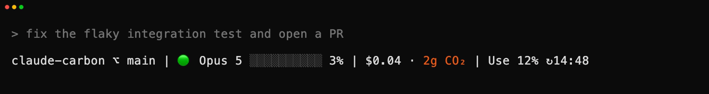
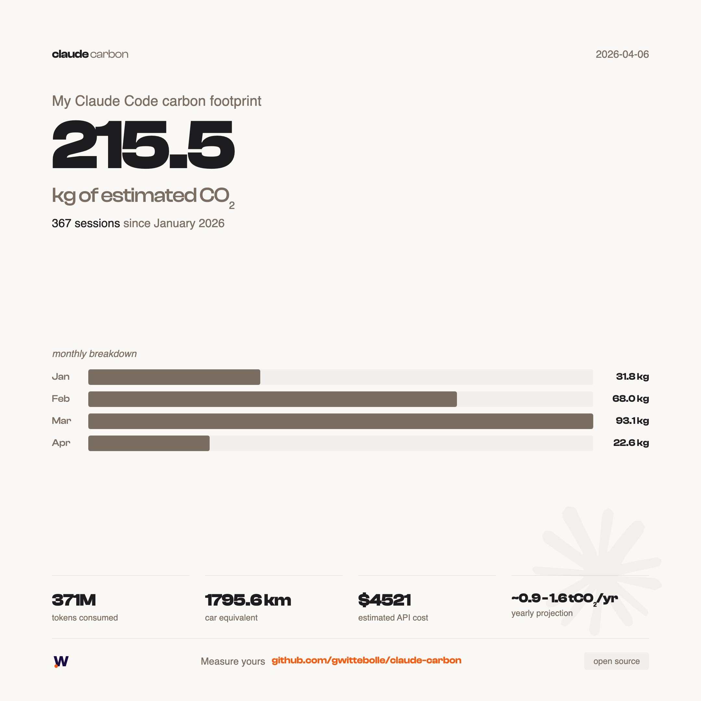
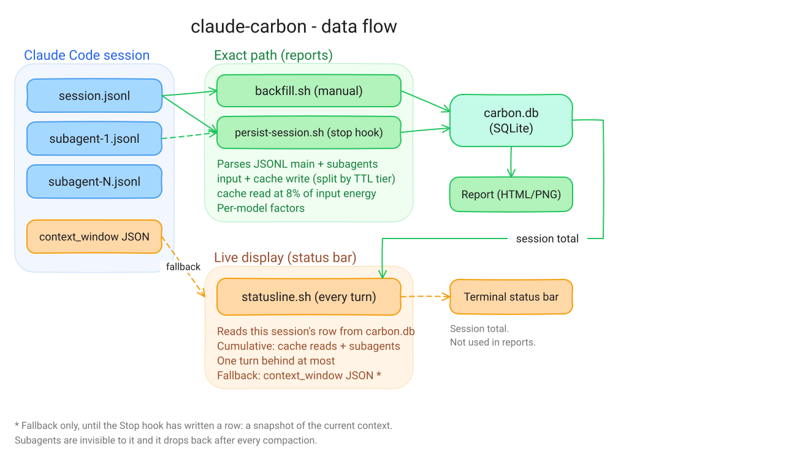

# claude-carbon

[](https://github.com/gwittebolle/claude-carbon/stargazers)
[](LICENSE)
[](https://github.com/gwittebolle/claude-carbon/releases)
[](https://www.npmjs.com/package/claude-carbon)
[](https://github.com/gwittebolle/claude-carbon/actions/workflows/ci.yml)

Track the carbon footprint of your Claude Code sessions.



**1. Install (or update):**

macOS, Linux, WSL:

```bash
curl -fsSL https://raw.githubusercontent.com/gwittebolle/claude-carbon/main/install.sh | bash
```

Windows (PowerShell), which needs [Git for Windows](https://git-scm.com/downloads/win) and two packages first - see [Windows](#windows):

```powershell
irm https://raw.githubusercontent.com/gwittebolle/claude-carbon/main/install.ps1 | iex
```

Or, on any platform with Node.js:

```bash
npx claude-carbon
```

Same command to install and to update to the latest version (all three run the same installer).

**2. Restart Claude Code.** Your CO2 appears in the status line:

```
claude-carbon ⌥ main | 🟢 Opus 4.7 ▓▓▓░░░░░░░ 35% | $0.50 · 65g CO₂ | Use 24% ↻13:00
```

Segments, left to right: project + git branch, model + context window %, session cost + CO2, 5h block usage % + reset time. A 🔥 prefix appears when the sustained burn rate would overshoot 100% of the limit by the end of the 5h block (after a 15 min grace window, only once usage reaches 15%).

> **Where the CO2 shows up.** The status line is a feature of the Claude Code terminal UI. It is displayed only when you run `claude` in a terminal, including the integrated terminal of VS Code or JetBrains. The IDE extensions' chat panel has no status line at all, so nothing is displayed there even though the hooks still run and your sessions are recorded: `/carbon-report` covers them. If you use the VS Code panel and want the live CO2, open a terminal in VS Code (`` Ctrl+` ``) and run `claude` from there. The web app (claude.ai/code) and the desktop app run neither the status line nor the hooks, so nothing is displayed or recorded there.

**5h quota source.** The percentage comes directly from Anthropic's `/api/oauth/usage` endpoint (the same data Claude Code displays in `/usage`). No heuristic, no token-limit file to seed. Two sources in order:

1. **stdin** (preferred): if Claude Code injects `rate_limits.five_hour.used_percentage` in the statusline JSON, that value is used straight away.
2. **OAuth API fallback**: `GET https://api.anthropic.com/api/oauth/usage` with the bearer token from macOS Keychain, `CLAUDE_CODE_OAUTH_TOKEN`, or `~/.claude/.credentials.json`. Cached 60s in `~/.claude/claude-carbon/oauth-usage.json`.

Accurate on every plan, including Max 20x.

**3. Use the slash commands:**

- `/carbon-report` - text report with totals, equivalences, top sessions
- `/carbon-card` - generate shareable PNG report cards (requires `playwright-core`, see [Dependencies](#dependencies))
- `/carbon-update` - update to the latest version and re-price history (see [Updating](#updating))

## What it does

- Adds a live CO2 estimate to the Claude Code status line, next to the session cost
- Persists each session to a local SQLite database
- Backfills historical data from existing `~/.claude` transcripts
- Two slash commands: `/carbon-report` (text) and `/carbon-card` (PNG)

## Example report

<p align="center">
  
</p>

Generate yours with `/carbon-card` in Claude Code. Exports summary and detailed PNGs to `exports/`.

<details>
<summary>Advanced options (CLI)</summary>

```bash
# Since a specific date
bash ~/code/claude-carbon/scripts/generate-report.sh --since 2026-03-01

# All time
bash ~/code/claude-carbon/scripts/generate-report.sh --all

# A closed period (--until is an exclusive upper bound: this one stops at June 30th)
bash ~/code/claude-carbon/scripts/generate-report.sh --since 2026-01-01 --until 2026-07-01
```

</details>

<details>
<summary>Custom install directory</summary>

```bash
curl -fsSL https://raw.githubusercontent.com/gwittebolle/claude-carbon/main/install.sh | CLAUDE_CARBON_DIR=~/my-path/claude-carbon bash
```

The env var has to sit on the `bash` side of the pipe, not the `curl` side, or the installer never sees it.

</details>

<details>
<summary>Second Claude environment (CLAUDE_CONFIG_DIR)</summary>

If you run a second Claude Code environment out of its own config directory, e.g.

```bash
alias claude-work="CLAUDE_CONFIG_DIR=~/.claude-work claude"
```

install claude-carbon into that same directory by passing `CLAUDE_CONFIG_DIR` to the installer:

```bash
curl -fsSL https://raw.githubusercontent.com/gwittebolle/claude-carbon/main/install.sh | CLAUDE_CONFIG_DIR=~/.claude-work bash
```

The status line, the hooks, the database and the `/carbon-*` commands all live under that config dir, so each environment tracks its own sessions independently. When `CLAUDE_CONFIG_DIR` is unset everything falls back to `~/.claude` as before.

</details>

<details>
<summary>Manual install</summary>

```bash
git clone https://github.com/gwittebolle/claude-carbon.git ~/code/claude-carbon
bash ~/code/claude-carbon/scripts/setup.sh
bash ~/code/claude-carbon/scripts/configure-settings.sh
```

The second script merges the block below into `~/.claude/settings.json` (additively: an existing status line or third-party hooks are left alone) and symlinks the `/carbon-*` commands. To wire it by hand instead, skip it and add:

```json
{
  "statusLine": {
    "type": "command",
    "command": "~/code/claude-carbon/scripts/statusline.sh"
  },
  "hooks": {
    "Stop": [
      {
        "matcher": "",
        "hooks": [
          {
            "type": "command",
            "command": "~/code/claude-carbon/scripts/persist-session.sh"
          }
        ]
      }
    ],
    "SessionStart": [
      {
        "matcher": "",
        "hooks": [
          {
            "type": "command",
            "command": "~/code/claude-carbon/scripts/safety-rescan.sh"
          }
        ]
      }
    ]
  }
}
```

The `Stop` hook records the session that just ended. The `SessionStart` one re-scans for sessions that hook missed (crash, kill) and drives the daily update check the status line reads; without it you are never told a new version exists.

Restart Claude Code.

</details>

## For teams

claude-carbon measures one developer's sessions, locally. If the question comes from your CTO, a client RFP or a CSR committee, the same methodology exists as a hosted layer:

- [Free calculator](https://tokenclimate.com/en/calculator?ref=github) and [per-model factor sheets](https://tokenclimate.com/en/models?ref=github) - the exact versioned factors of this repo, browsable.
- [AI usage report](https://tokenclimate.com/bilan/en?ref=github) - a self-serve, shareable report of your organisation's real Claude usage (cost, CO2e, water, energy), generated in minutes from an Anthropic admin key. The key is never stored; the methodology annex is citation-ready.
- [TokenClimate](https://tokenclimate.com/en?ref=github) - hosted team dashboards. Both sides share this repo's golden vectors, verified weekly in CI.

The only places the OSS points there are a one-line footer in `/carbon-report` and a small credit on the `/carbon-card` PNGs. No status-line promo, no email capture: nothing leaves your machine.

### PR dev footprint (/carbon-pr)

The number reviewers rarely see is what the PR cost to develop: your local Claude Code sessions while building the branch. `/carbon-pr` (or `scripts/generate-pr-report.sh`) sums the recorded sessions of the current branch and posts one sticky comment on its open PR, through your own `gh` auth. Run it after your push; running it again updates the same comment in place.

```
**Claude Code carbon report** · developing this PR
124 g CO2e · $3.00 · 180k tokens · 1.5M cache reads · 2 sessions
```

How the sessions are attributed: the Stop hook stores each session's git branch (read from the transcript), and the report selects `project + branch`. Sessions recorded before this column existed carry no branch; `scripts/backfill.sh` repairs them while their transcripts are still on disk (about 30 days). Sessions started from a subdirectory of the repo are stored under the subdirectory's name and stay out of the sum. A session that ends on another branch than it started is attributed to where it finished.

Turning it off is the default: nothing is posted unless you run it. `--dry-run` previews the comment, `--pr <number>` targets a specific PR, and deleting the comment on GitHub is the full cleanup.

## How it works



**Three data paths, two levels of accuracy:**

| Script               | Trigger                 | Data source           | Subagents    | Cache reads         | Accuracy      |
| -------------------- | ----------------------- | --------------------- | ------------ | ------------------- | ------------- |
| `backfill.sh`        | Manual / setup          | JSONL files           | Included     | Counted (8% energy) | Best estimate |
| `persist-session.sh` | Stop hook (session end) | JSONL files           | Included     | Counted (8% energy) | Best estimate |
| `statusline.sh`      | Every turn (live)       | `carbon.db` row       | Included     | Counted (8% energy) | One turn late |

**backfill** and **persist-session** parse the raw JSONL transcripts (main session + subagent files), applying per-model emission factors. They deduplicate assistant messages by `(message.id, requestId)`, so resumed and compacted sessions are not double-counted (this matches `ccusage`; without it the token sum inflates roughly 3x). Each session stores its raw token breakdown (input, cache write, cache read, output), which feeds the SQLite database used by reports.

**Cost** is the theoretical API list value (pay-as-you-go), not your subscription price: input, output, cache write, and cache read (0.1x input) at current Anthropic rates, set in `data/prices.json`. Cache writes are billed per TTL tier, 1.25x input for the 5-minute tier and 2x for the 1-hour one; each session's split is read from its transcript rather than assumed (Claude Code writes at the 1-hour tier). On deduplicated data it matches `ccusage`.

**statusline** reads this session's row from `carbon.db` at each turn, so the CO2 it shows is the session total on the same basis as the reports, one turn behind at most. Before that row exists (first turn, or no database yet) it falls back to an estimate from `context_window.total_input_tokens`, which is the size of the current context rather than a running total: subagents are invisible to it and every compaction sends it back down. Either way the status line displays, it never feeds the reports.

### Surviving the 30-day transcript purge

Claude Code deletes JSONL transcripts after about 30 days, so the SQLite database is the durable record. The `Stop` hook captures each session before its transcript ages out, and a once-a-day background re-scan (`SessionStart` hook, `safety-rescan.sh`) catches any session the `Stop` hook missed while its transcript still exists. Because each row stores raw token counts, `recompute.sh` regenerates cost and CO2 from `data/factors.json` + `data/prices.json` at any time, with no transcript needed. When Anthropic changes a price or a factor is revised, edit the config and run:

```bash
bash scripts/recompute.sh
```

## Commands

| Command          | What it does                                        |
| ---------------- | --------------------------------------------------- |
| `/carbon-report` | Text report with totals, equivalences, top sessions |
| `/carbon-card`   | Generate shareable PNG report cards                 |
| `/carbon-badge`  | Shields.io badge of your total footprint for your READMEs |
| `/carbon-pr`     | Post the dev footprint of the current branch on its PR |
| `/carbon-update` | Update to the latest version and re-price history   |

<details>
<summary>Scripts (run automatically, rarely needed manually)</summary>

| Script               | What it does                                                                              |
| -------------------- | ----------------------------------------------------------------------------------------- |
| `setup.sh`           | Init database, backfill historical sessions, show total                                   |
| `statusline.sh`      | Status line script (called automatically by Claude Code)                                  |
| `persist-session.sh` | Stop hook (saves session data on exit)                                                    |
| `safety-rescan.sh`   | SessionStart hook (throttled background re-scan, catches missed sessions)                 |
| `backfill.sh`        | Re-parse all historical JSONL transcripts (incl. subagents)                               |
| `recompute.sh`       | Re-derive cost/CO2 from stored tokens after a price/factor change (no transcripts needed) |
| `generate-report.sh` | Export PNG report cards (CLI, with `--since` / `--until` / `--all`)                                   |
| `generate-badge.sh`  | Print the shields.io badge markdown + URL (CLI)                                           |
| `generate-pr-report.sh` | Post the branch's dev footprint on its PR (CLI, `--dry-run` / `--pr`)                  |

Note: backfill now derives project names from the transcript's `cwd` (matching the live hook). Sessions backfilled before this change keep their old, possibly truncated names; delete those rows and re-run `backfill.sh` to normalize them.

</details>

## Badge

`/carbon-badge` prints a ready-to-paste shields.io badge with your measured all-time footprint, clickable back to this repo:

[](https://github.com/gwittebolle/claude-carbon)

<sub>That badge is live, not a mockup: the author's own total, 1,025 sessions measured between 15 January 2026 and 20 August 2026. It is one developer's footprint, not the project's.</sub>

```markdown
[](https://github.com/gwittebolle/claude-carbon)
```

The badge is a static image built from your local database, so the number is measured, not estimated on the fly. Re-run `/carbon-badge` whenever you want to refresh it.

Numbers follow the locale the report uses (`fr` prints `12,4 kg`, `us` and the world default print `12.4 kg`); `CLAUDE_CARBON_LOCALE` forces a set.

## Using with ccstatusline

Claude Code accepts a single `statusLine` command, so claude-carbon's full status line and [ccstatusline](https://github.com/sirmalloc/ccstatusline) cannot run side by side. If ccstatusline drives your status line, embed the CO2 segment instead: in the ccstatusline TUI, add a `Custom Command` widget pointing to

```
~/code/claude-carbon/scripts/statusline.sh --segment
```

(adjust the path if you installed with `CLAUDE_CARBON_DIR`). The widget receives the same status JSON on stdin and prints just the cost + CO2 pair, e.g. `$0.68 · 35g CO₂`. Segment mode never touches the network. Recording to the local database is unaffected either way: persistence runs from hooks, not from the status line.

## Emission factors

Factors from [Jegham et al. 2025](https://arxiv.org/abs/2505.09598), an arXiv preprint that estimates the energy consumption of LLM inference on AWS infrastructure from public API performance data (latency, throughput) over inferred hardware configurations.

| Model  | Input (gCO2e/Mtok) | Output (gCO2e/Mtok) | Basis                      |
| ------ | ------------------ | ------------------- | -------------------------- |
| Fable  | 156                | 3304                | Extrapolated (2x Opus)     |
| Opus   | 78                 | 1652                | Extrapolated (2x Sonnet)   |
| Sonnet | 39                 | 826                 | 3-point fit (Jegham v6)    |
| Haiku  | 20                 | 413                 | Extrapolated (0.5x Sonnet) |

**Important: these are order-of-magnitude estimates, not precise measurements.**

- Sonnet factors are a 3-point least-squares fit to the three Claude 3.7 Sonnet per-query energies estimated in Jegham et al. v6 (0.950 / 2.989 / 5.671 Wh), giving a ~21:1 output:input ratio. The value is consistent with [EcoLogits](https://ecologits.ai): its independent estimate for Sonnet brackets the same range (a wide band, so this is a consistency check, not proof). Fable, Opus and Haiku are extrapolated (no public data from Anthropic on per-model energy consumption); Opus = 2x Sonnet matches both the current EcoLogits Opus 4.5+ parameter ratio and the Anthropic price ratio (honest band 2x-5x).
- Sessions run on non-Anthropic models (e.g. local models behind `ANTHROPIC_BASE_URL`) are stored with their raw tokens but zero cost/CO2 and excluded from reports - a datacenter factor doesn't apply to them. Add patterns to `exclude_models` in `data/factors.json` to exclude more models by name.
- Cache read tokens are counted at a reduced factor (default 0.08 of an input token, set in `data/factors.json`). A cached token skips prefill compute but still incurs decode-phase memory reads, so it is cheap but not free. This is an engineering estimate derived from the literature, not Anthropic's 0.1x billing ratio. See [METHODOLOGY.md](METHODOLOGY.md).
- Carbon intensity uses the AWS region grid (location-based, 0.287 kgCO2e/kWh), not real-time grid data. This sits at the low end of the location-based range; the US national average is ~380 g/kWh.
- Anthropic does not publish Scope 1, 2, or 3 emissions. These estimates are independent and based on academic research, not provider data.

Report equivalences follow your locale, since a car and a kWh differ by ~2x between countries: ADEME/SNCF factors on a French or undetected locale, EPA ones in miles on a US locale, world-average ones otherwise (200 gCO2/km by car, 8.7 g per smartphone charge). Force a set with `CLAUDE_CARBON_LOCALE` (`fr`, `us`, `world`, or any locale string). The factors live in `data/factors.json` under `equivalences`.

Factors are editable in `data/factors.json`. See [METHODOLOGY.md](METHODOLOGY.md) for the full scientific basis, formula, and equivalences.

### Golden vectors

The methodology is pinned by golden test vectors in [`tests/methodology-vectors.json`](tests/methodology-vectors.json): hand-computed expected CO2/cost values for known token breakdowns, replayed by `bash tests/run-vectors.sh` in CI on every push. Downstream consumers (such as TokenClimate) keep a copy of this file and verify weekly that their implementation produces the same numbers. If you edit `data/factors.json` or `data/prices.json`, update the vectors in the same commit, otherwise CI fails.

## Updating

When a newer version is available, the status line shows a discreet `⬆ /carbon-update` hint. The check runs in the background (at most once a day, never on the status line's hot path); opt out with `CLAUDE_CARBON_NO_UPDATE_NOTIFIER=1`.

To update, run `/carbon-update` in Claude Code, or re-run the installer:

```bash
curl -fsSL https://raw.githubusercontent.com/gwittebolle/claude-carbon/main/install.sh | bash
```

- Updating re-prices your stored history with the new factors automatically (CO2 only; cost figures are left intact). Run `scripts/recompute.sh --with-cost` yourself only after a price change.
- If you edited `data/factors.json` or `data/prices.json` locally, the update keeps your edits; on a conflict with upstream it saves yours to `*.local.bak` and tells you.
- Installed via the plugin marketplace? Update with Claude Code's built-in `/plugin update` instead.

## Dependencies

- `jq` - JSON parsing
- `sqlite3` - local database
- `git` - branch detection in status line (optional)
- `curl` - 5h quota usage via Anthropic's `/api/oauth/usage` endpoint (optional, 60s cache)
- `node` + `playwright-core` + Chromium - PNG export for `/carbon-card` (optional)

`jq` and `sqlite3` are pre-installed on macOS. On Linux: `apt install jq sqlite3`. On Windows, see below.

To use `/carbon-card`, install Playwright and its Chromium browser:

```bash
npm install -g playwright-core
npx playwright install chromium
```

## Windows

claude-carbon is bash, and stays bash on Windows. That is deliberate rather than a
shortcut: on native Windows, Claude Code runs status line and hook commands through
the bash that ships with [Git for Windows](https://git-scm.com/downloads/win), falling
back to PowerShell only when Git Bash is absent
([status line docs](https://code.claude.com/docs/en/statusline#windows-configuration),
[hooks docs](https://code.claude.com/docs/en/hooks)). The plugin speaks the shell its
host already spawns.

**Native Windows.** Install Git for Windows, plus the two commands it does not ship:

```powershell
winget install Git.Git --source winget
winget install jqlang.jq --source winget
winget install SQLite.SQLite --source winget
```

Then, in the same terminal:

```powershell
irm https://raw.githubusercontent.com/gwittebolle/claude-carbon/main/install.ps1 | iex
```

Everything else the plugin needs - `bash`, `awk`, `sed`, `grep`, `date`, `curl`,
`git`, `cygpath` - comes with Git for Windows.

**WSL 2.** Nothing special: run the `curl | bash` installer inside your distribution.
Claude Code, its transcripts and claude-carbon all live on the Linux side. This is
the path to pick if your projects are already in WSL. VS Code reaches it through the
Remote - WSL extension.

**Marketplace install.** `/plugin install claude-carbon@claude-carbon` behaves the
same as on macOS, once Git for Windows, `jq` and `sqlite3` are present.

### Windows specifics

- **Git Bash is required.** Without it Claude Code routes commands to PowerShell,
  which cannot run a `.sh` file. `claude doctor` tells you which shell it picked. If
  Git is installed somewhere unusual, point Claude Code at it in `settings.json`:
  `{"env": {"CLAUDE_CODE_GIT_BASH_PATH": "C:\\Program Files\\Git\\bin\\bash.exe"}}`.
- **Paths in `settings.json` use forward slashes** (`C:/Users/you/code/claude-carbon/...`).
  Git Bash eats unquoted backslashes, and the command then fails with no visible error.
  The installer writes them correctly; only hand-edits need the care.
- **Slash commands are copied, not symlinked.** Git Bash cannot create a real symlink
  without Developer Mode, so `/carbon-report` and friends are copied into
  `~/.claude/commands/` and refreshed on every update.
- **Sandboxing is not available** on native Windows (a Claude Code limitation, not
  this plugin's). Use WSL 2 if you need it.
- **`/carbon-card` additionally needs Node.js**: `winget install OpenJS.NodeJS --source winget`.
- **Behind a TLS-inspecting proxy or antivirus**, the clone fails with
  `SSL certificate problem: unable to get local issuer certificate`. Git for Windows
  checks certificates against its own bundled CA list, which does not know the root
  such tools re-sign traffic with; the Windows certificate store does. Switch git to
  it (verification stays on) and rerun the installer:
  `git config --global http.sslBackend schannel`. The installer prints this hint
  when it detects the case. The same interception is why `winget` needs
  `--source winget` on those machines: the Microsoft Store source fails its
  certificate check and, without an explicit source, winget aborts instead of
  falling back.

CI runs the full test suite on `windows-latest` under Git Bash, alongside Ubuntu,
plus two Windows-only suites: `tests/run-windows-e2e.sh` (native paths through the Stop
hook and the status line, hook manifests spawned the way Claude Code spawns them) and
`tests/run-install-ps1-tests.ps1`.

## Reduce your footprint

Measuring is step one. Here are concrete levers to reduce your AI carbon footprint, ranked by impact.

### Use the right model for the task

Output tokens cost ~21x more energy than input tokens (the marginal output:input ratio fit on Jegham v6). Opus is estimated at ~2x Sonnet per token (uncertainty band 2x-5x, see METHODOLOGY.md).

```json
{
  "env": {
    "CLAUDE_CODE_SUBAGENT_MODEL": "claude-haiku-4-5"
  }
}
```

Use Opus for architecture and planning. Sonnet for daily work. Haiku for subagents (exploration, file reading, reviews). As an indicative estimate with this tool's factors, this alone can cut your emissions by up to ~60% vs all-Opus.

### Install RTK (Rust Token Killer)

[RTK](https://github.com/rtk-ai/rtk) is a CLI proxy that filters noise from shell outputs (progress bars, verbose logs, passing tests) before they hit the context window. 60-90% token reduction on CLI commands, zero quality loss.

```bash
brew install rtk-ai/tap/rtk
rtk init -g
```

### Reduce thinking tokens

Claude's extended thinking can use up to 32k hidden tokens per message. Capping it reduces consumption without degrading quality on routine tasks.

```json
{
  "env": {
    "MAX_THINKING_TOKENS": "10000"
  }
}
```

### Compact earlier

By default, Claude Code compacts context at 95% usage. Compacting earlier keeps context cleaner and avoids bloated sessions.

```json
{
  "env": {
    "CLAUDE_AUTOCOMPACT_PCT_OVERRIDE": "50"
  }
}
```

### Disconnect unused MCP servers

Every connected MCP server ships its full tool schemas into the context window with every request, whether the session uses them or not. Most of that overhead is served from prompt cache after the first turn, and cache reads carry a much lower energy factor (see METHODOLOGY.md), so the saving per turn is modest; the gain comes from repetition across every turn of every session.

```bash
claude mcp list
```

Keep the servers the project actually uses, remove the rest with `claude mcp remove <name>`.

### Write concise instructions

Add to your project's CLAUDE.md:

```
Be concise. No preamble, no summaries unless asked.
```

Output tokens are the most expensive in both cost and energy.

### Combined impact

These reductions are indicative estimates, not measurements on a benchmark workload. The RTK figure comes from RTK's own documentation. The Haiku rows follow from this tool's own factors (Haiku = 0.5x Sonnet = 0.25x Opus per token): -50% when your subagents would otherwise run Sonnet, -75% when they would run Opus. They inherit the 0.5x extrapolation, the widest uncertainty band in the tool (see METHODOLOGY.md); if most of your usage is already Haiku, your absolute total rides on that band, so read it as an order of magnitude.

| Lever                | Estimated reduction          |
| -------------------- | ---------------------------- |
| Right model per task | -60% vs all-Opus             |
| RTK                  | -70% on CLI tokens           |
| Thinking cap at 10k  | -70% on thinking tokens      |
| Haiku subagents      | -75% vs Opus, -50% vs Sonnet |
| **All combined**     | **-50 to 70% total**         |

### Related projects

- [EcoLogits](https://ecologits.ai) - Python library estimating the footprint of GenAI API calls across providers.
- [CodeCarbon](https://github.com/mlco2/codecarbon) - measures the emissions of compute you run yourself (training, local inference).
- [ImpactIA](https://github.com/SNCFdevelopers/ImpactIA) - AI impact calculator and guide by SNCF, Wavestone and Resilio.
- [green-claude](https://github.com/Institut-du-Numerique-Responsable/green-claude) - Claude Code skill that steers generated code toward eco-design rules (RGESN, GR491).

### Further reading

- [IEA - Energy and AI (2025)](https://www.iea.org/reports/energy-and-ai/) - data center projections
- [Jegham et al. - How Hungry is AI?](https://arxiv.org/abs/2505.09598) - per-model energy estimates
- [UCL/UNESCO - 90% AI energy reduction](https://www.ucl.ac.uk/news/2025/jul/practical-changes-could-reduce-ai-energy-demand-90) - frugal AI approaches
- [GreenIT.fr - AI impacts 2025-2030](https://www.greenit.fr/impacts-ia-monde-2025-2030-rapport/) - French data

## Why

Every Claude Code session uses real compute, real energy, real emissions. The number is small per query, but it adds up. Making it visible is the first step to owning it.

## Citing

If claude-carbon's numbers or methodology end up in your article, talk or product, a citation is appreciated. GitHub's "Cite this repository" button generates BibTeX/APA from [CITATION.cff](CITATION.cff). Short form:

> Wittebolle, G. (2026). claude-carbon: carbon footprint tracker for Claude Code sessions. https://github.com/gwittebolle/claude-carbon

The shareable report cards already carry this attribution in their footer, so reposting a card as-is credits the tool.

## Open source

claude-carbon is free and open source under the [MIT license](LICENSE). Contributions welcome.

Built by [Gaetan Wittebolle](https://github.com/gwittebolle).
